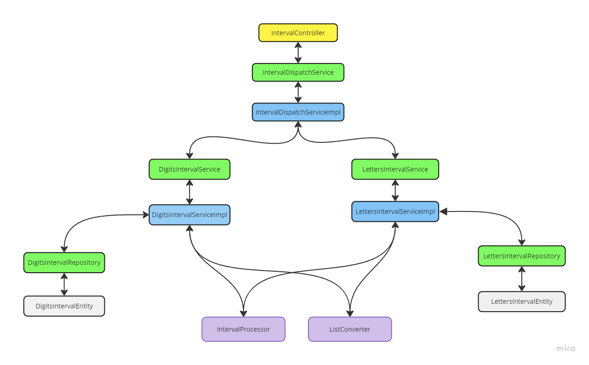

# Тестовое задание ШИФТ ЦФТ

## Описание
Проект представляет собой веб-приложение на языке Java, предназначенное для обработки интервалов чисел или букв. Основные функции приложения включают:

- Объединение пересекающихся интервалов.
- Сохранение непересекающихся интервалов в памяти SQL-базы данных (H2).
- Предоставление минимального интервала из базы данных по запросу.

## Конфигурация и запуск (Windows)
Для сборки и запуска потребуется Java 21 и git. Убедитесь, что они у вас установлены (+ прописаны в PATH) и выбрана нужная версия

```java --version```

1. Клонирование репозитория

```git clone https://github.com/MachineByte/cft-task-backend-api.git```

2. Переход в директорию проекта

```cd cft-task-backend-api```
3. Очистка билдов Gradle

```gradlew clean```

4. Автоматическая сборка и запуск приложения

```gradlew bootRun``` для cmd

```./gradlew bootRun``` для PowerShell

## Endpoints

### Добавление интервала из массивов целых чисел
```
/api/v1/intervals/merge?kind=digits
```

```
curl -X POST "http://localhost:8080/api/v1/intervals/merge?kind=digits" -H "Content-Type: application/json" -d "[[1, 4], [3, 6], [8, 10]]"
```

### Добавление интервала из массивов букв
```
/api/v1/intervals/merge?kind=letters
```
```
curl -X POST "http://localhost:8080/api/v1/intervals/merge?kind=letters" -H "Content-Type: application/json" -d "["a", "f"],["d", "j"],["r", "z"]"
```
### Запрос минимального целочисленного интервала
```
/api/v1/intervals/min?kind=digits
```
```
curl -X GET "http://localhost:8080/api/v1/intervals/min?kind=digits"
```
### Запрос минимального буквенного интервала
```
/api/v1/intervals/min?kind=letters
```
```
curl -X GET "http://localhost:8080/api/v1/intervals/min?kind=letters"
```
## Ссылки внутри приложения

### Swagger UI
```http://localhost:8080/swagger-ui/index.html#/```
### База данных H2
```http://localhost:8080/h2-console```

Для подключения нужно указать сделующие параметры. При этом приложение уже должно быть поднято
- `Driver class` org.h2.Driver
- `JDBC URL` jdbc:h2:mem:testdb
- `User name` sa
- `Password` оставить пустым


## Описание внутренней работы приложения

### Компоненты
1. **Контроллер**: Принимает HTTP-запросы и передает их на обработку сервис-диспетчеру.
2. **Сервис-диспетчер**: Определяет тип запроса и перенаправляет его на соответствующий сервис или выбрасывает исключение.
3. **Сервисы для отдельных типов данных**: Обрабатывают запросы, вызывая параметризованные статические методы утилитарных классов для работы с интервалами. Результаты сохраняются в базе данных или извлекаются из нее.
4. **Утилитарные классы**: предоставляют логику работы с интервалами универсальную для любого типа данных

### Преимущества данных решений
1. **Упрощенное добавление новых типов данных**: Достаточно создать новый сервис и соответствующие сущности, без необходимости переписывать существующую логику работы с интервалами.
2. **Централизованная обработка запросов**: Сервис-диспетчер управляет маршрутизацией запросов, обеспечивая единую точку входа для любых типов данных.

### Диаграмма классов


## Технологии
- Java
- Spring Boot
- Spring Web
- Spring Data JPA
- JUnit5
- Mockito
- H2 Database
- Swagger


